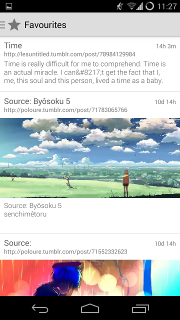
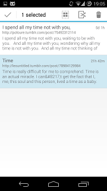

Download
===

Recommended version: [SimpleRss-0.20.3.apk](https://raw.github.com/poloure/rss/master/apk/SimpleRss-0.20.3.apk)

Development version: [rss-0.24.5.apk](https://raw.github.com/poloure/rss/master/apk/rss-0.24.5.apk)

Screenshots
===

Click for full size images.

[](https://raw.github.com/poloure/rss/master/screenshots/one.png)
[](https://raw.github.com/poloure/rss/master/screenshots/two.png)
[](https://raw.github.com/poloure/rss/master/screenshots/three.png)

[](https://raw.github.com/poloure/rss/master/screenshots/four.png)
[](https://raw.github.com/poloure/rss/master/screenshots/five.png)
[](https://raw.github.com/poloure/rss/master/screenshots/six.png)


Permissions
===
```
   <uses-permission android:name="android.permission.INTERNET"/>
```

INTERNET - This is to download rss feeds and images from the feeds.

```
   <uses-permission android:name="android.permission.WAKE_LOCK"/>
```

WAKE_LOCK - This is to update feeds when the app is closed mid update and when scheduled to update (in settings).

Building
===

Make sure to have the Android SDK Platform API 19 installed.

To build the code using Gradle:

```
   ./gradlew assembleDebug
```

Install the apk to a device connected with adb:

```
   adb install -r build/apk/SimpleRss-debug-unaligned.apk
```