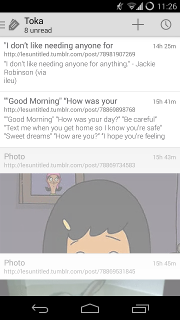

SimpleRss
===

News Aggregator for Android 4.0+.

You can find the latest APK signed by me in the apk folder.

Screenshots
===

[](screenshots/one.png)
[](screenshots/two.png)
[](screenshots/three.png)

[](screenshots/four.png)
[](screenshots/five.png)
[](screenshots/six.png)


Permissions
===
```
   <uses-permission android:name="android.permission.INTERNET"/>
```

INTERNET - This is to download rss feeds and images from the feeds.

```
   <uses-permission android:name="android.permission.WAKE_LOCK"/>
```

WAKE_LOCK - This is to update feeds when the app is closed mid update and when scheduled to update (in settings).

Building
===

Make sure to have the Android SDK Platform API 19 installed.

To build the code using Gradle:

```
   ./gradlew assembleDebug
```

Install the apk to a device connected with adb:

```
   adb install -r build/apk/SimpleRss-debug-unaligned.apk
```